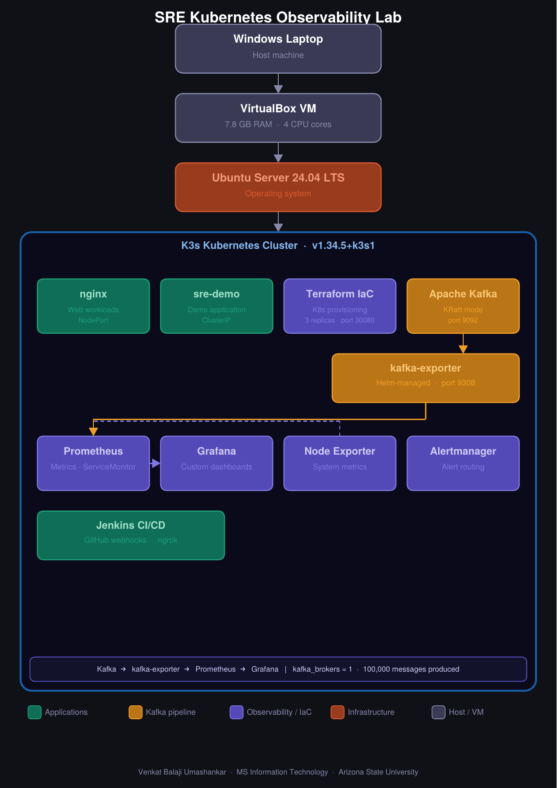
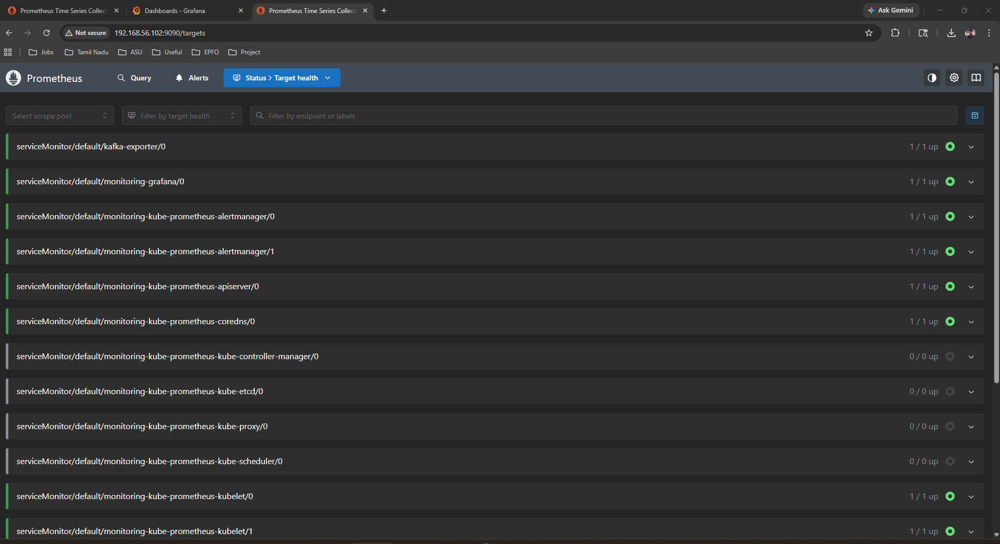
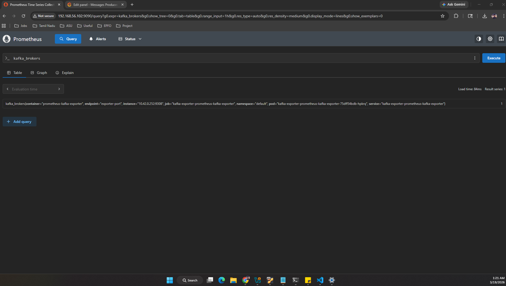
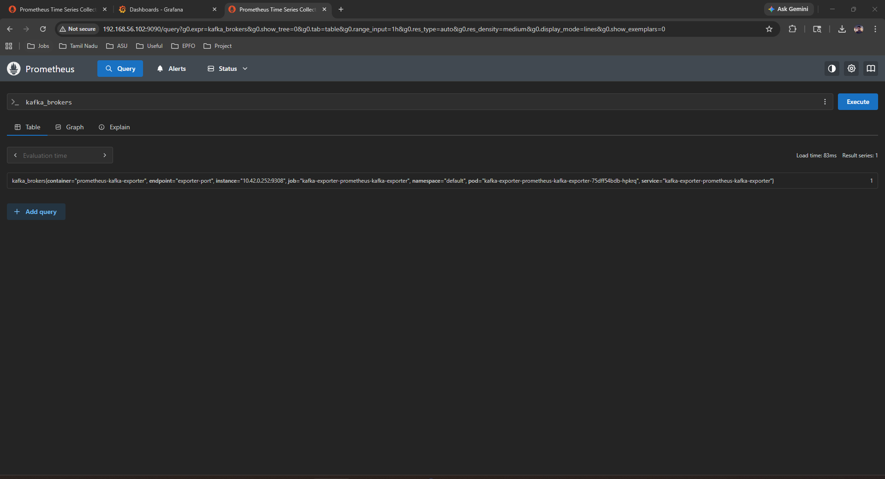
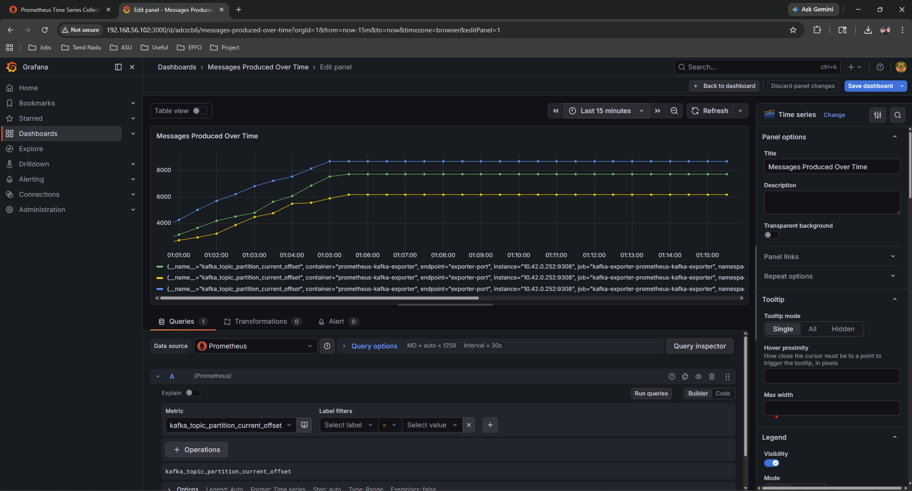
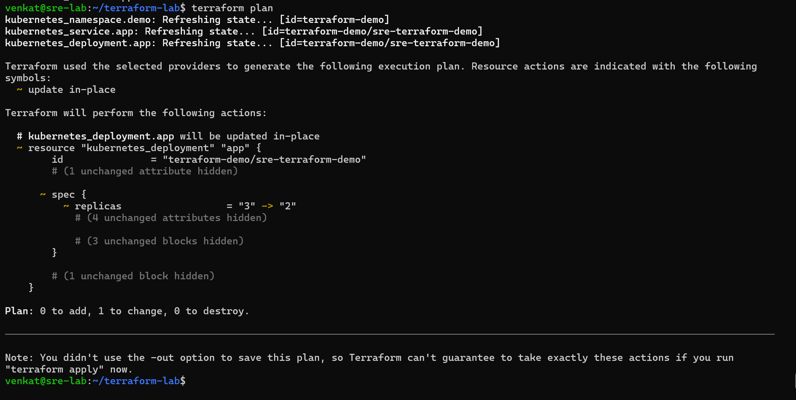
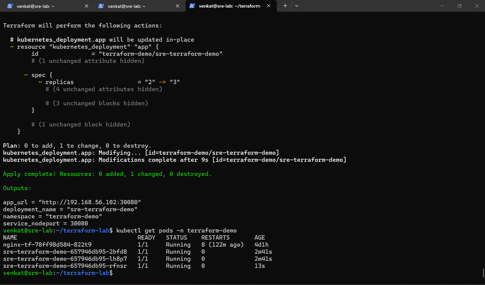
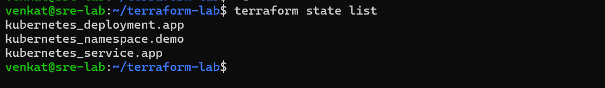

# SRE Kubernetes Observability Lab

Production-style **Site Reliability Engineering lab** demonstrating Kubernetes deployment, CI/CD automation, distributed streaming with **Apache Kafka**, and full-stack observability using **Prometheus and Grafana**.

## Table of Contents
- [Project Overview](#-project-overview)
- [Architecture](#architecture)
- [Infrastructure](#infrastructure)
- [Kubernetes Cluster](#step-2--kubernetes-cluster-verification)
- [Monitoring Stack](#observability-stack)
- [Kafka Observability](#kafka-observability-integration)
- [Terraform IaC](#terraform-infrastructure-as-code)
- [CI/CD Pipeline](#step-8--jenkins-cicd-pipelines)
- [Incident Simulation](#production-incident-simulation)
- [Skills Demonstrated](#skills-demonstrated)
- [Author](#author)

---

## 🚀 Project Overview

This project simulates a **real-world Site Reliability Engineering (SRE) environment** built on Kubernetes.

The lab demonstrates how infrastructure engineers deploy applications, monitor cluster health, investigate incidents, automate deployments using CI/CD pipelines, and integrate distributed streaming systems with full observability.

### Key Components
- Kubernetes (K3s) cluster
- Containerized workloads
- Apache Kafka distributed streaming
- Prometheus monitoring
- Grafana observability dashboards
- Jenkins CI/CD pipelines
- Incident simulation and troubleshooting

### What This Project Demonstrates
- Kubernetes cluster operations
- Distributed systems integration (Kafka)
- Observability and monitoring practices
- CI/CD automation workflows
- SRE incident investigation process
- Real-world debugging (DNS failures, CrashLoopBackOff, Helm misconfigurations)

---

## 🛠 Tech Stack

| Technology | Purpose |
|------------|---------|
| Kubernetes (K3s) | Container orchestration |
| Docker | Containerization |
| Apache Kafka | Distributed event streaming |
| Prometheus | Metrics collection |
| Grafana | Monitoring dashboards |
| Helm | Kubernetes package management |
| Terraform | Infrastructure as Code (IaC) |
| Jenkins | CI/CD automation |
| Ubuntu Server | Infrastructure environment |
| VirtualBox | Virtualization platform |

---

## Architecture



> 📄 [Download Full Architecture Diagram (PDF)](architecture/architecture.pdf)

This environment simulates a production infrastructure stack.

```
Windows Laptop
↓
VirtualBox VM
↓
Ubuntu Server
↓
K3s Kubernetes Cluster
↓
┌─────────────────────────────────────┐
│  Applications                        │
│  nginx · demo workloads · Kafka      │
└─────────────────────────────────────┘
↓
┌─────────────────────────────────────┐
│  Observability Pipeline              │
│  Kafka → kafka-exporter              │
│       → Prometheus → Grafana         │
└─────────────────────────────────────┘
```

---

## Infrastructure

| Component | Details |
|-----------|---------|
| Host Machine | Windows Laptop |
| Virtualization | VirtualBox |
| Operating System | Ubuntu Server 24.04 LTS |
| Kubernetes Distribution | K3s Kubernetes |
| RAM | 7.8 GB |
| CPU | 4 Cores |

This environment runs a full Kubernetes stack inside a virtual machine.

---

## Step 1 – VM Network Configuration

Networking inside the Ubuntu VM was verified.

Command used:
```bash
hostname -I
```

This shows interfaces used by:
- VirtualBox networking
- Docker bridge network
- Kubernetes pod networking


---

## Step 2 – Kubernetes Cluster Verification

A lightweight Kubernetes cluster was deployed using **k3s**.

```bash
kubectl get nodes
```

The node status shows **Ready**, confirming the Kubernetes control plane is running.


---

## Step 3 – Running Kubernetes Pods

All running workloads were verified across namespaces.

```bash
kubectl get pods -A
```

Running components include:

**Monitoring Stack**
- Prometheus
- Grafana
- Node Exporter
- kube-state-metrics

**Applications**
- nginx deployment
- demo workloads
- Kafka broker
- kafka-exporter

**System Components**
- CoreDNS
- metrics-server
- Traefik ingress controller


---

## Step 4 – Kubernetes Services

```bash
kubectl get svc
```

Services include:
- Grafana service
- Prometheus service
- Kafka service (ClusterIP, port 9092)
- kafka-exporter service (port 9308)
- nginx NodePort service
- demo application services


---

## Step 5 – Docker Images

Applications were containerized using Docker before deployment.

```bash
docker images
```

Custom application image:
```
venkatbalajiumashankar/sre-ci-cd-demo
```


---

## Step 6 – Accessing Grafana

Grafana dashboards were accessed using Kubernetes port forwarding.

```bash
kubectl port-forward svc/monitoring-grafana 3000:80
```

Access Grafana: [http://localhost:3000](http://127.0.0.1:3000)


---

## Step 7 – Grafana Monitoring Dashboards

Grafana visualizes Prometheus metrics for the Kubernetes cluster.

Metrics monitored include:
- CPU utilization
- Memory utilization
- Pod resource consumption
- Namespace workloads
- Cluster health metrics
- Kafka broker and topic metrics


---

## Step 8 – Jenkins CI/CD Pipelines

Jenkins automates container build and deployment.

Configured pipelines:

**Docker Build Pipeline** — Builds container images.

**Kubernetes Deployment Pipeline** — Deploys applications into the cluster.


---

## Step 9 – Successful CI/CD Deployment

The Jenkins pipeline builds the Docker image and deploys it automatically.

```
Finished: SUCCESS
```


---

## Step 10 – Kubernetes Deployment Verification

```bash
kubectl get deployments
```

Running deployments include:
- nginx
- web-demo
- sre-demo
- monitoring components
- kafka-exporter


---

## Kafka Observability Integration

This lab integrates **Apache Kafka** as a distributed event streaming platform with full observability through Prometheus and Grafana.

### Kafka Architecture

```
Apache Kafka (KRaft mode)
↓
kafka-exporter (Helm)
↓
Prometheus (ServiceMonitor)
↓
Grafana (Custom Dashboard)
```

### Kafka Deployment

Kafka was deployed on Kubernetes in **KRaft mode** (no ZooKeeper required) using a custom manifest with the official `apache/kafka:3.7.1` image:

```bash
kubectl apply -f kafka-statefulset.yaml
kubectl get pods | grep kafka
# kafka-0   1/1   Running   0   ...
```

### Kafka Exporter Setup

The kafka-exporter was deployed via Helm to expose Kafka metrics to Prometheus:

```bash
helm install kafka-exporter prometheus-community/prometheus-kafka-exporter \
  --set kafkaServer[0]="kafka:9092"
```

### Prometheus Integration

A **ServiceMonitor** was created to allow Prometheus to discover and scrape the kafka-exporter:

```yaml
apiVersion: monitoring.coreos.com/v1
kind: ServiceMonitor
metadata:
  name: kafka-exporter
  labels:
    release: monitoring
spec:
  selector:
    matchLabels:
      app: prometheus-kafka-exporter
  endpoints:
  - port: exporter-port
    interval: 30s
```

### Kafka Metrics in Prometheus

Live metrics confirmed in Prometheus:

```
kafka_brokers = 1
kafka_topic_partitions{topic="test-topic"} = 3
kafka_topic_partition_current_offset = 101000+
```

### Kafka Load Test

1,000 messages were produced initially, followed by a continuous load test at 50 messages/sec:

```bash
kubectl exec -it kafka-0 -- /opt/kafka/bin/kafka-producer-perf-test.sh \
  --topic test-topic \
  --num-records 100000 \
  --record-size 100 \
  --throughput 50 \
  --producer-props bootstrap.servers=localhost:9092
```

Output:
```
1000 records sent, 98.49 records/sec, 131.67 ms avg latency
```

### Prometheus Target — Kafka Exporter UP

Prometheus successfully scraping kafka-exporter with **1/1 up** status:



---

### Kafka Metrics in Prometheus Query

Live `kafka_brokers` metric query confirming broker is online:



---

### Kafka Broker Metric — Graph View

`kafka_brokers = 1` plotted over time in Prometheus:



---

### Custom Grafana Dashboard

A custom Grafana dashboard was built from scratch visualizing:
- **Kafka Brokers Online** (Stat panel)
- **Kafka Topic Partitions** (Stat panel)
- **Messages Produced Over Time** (Time series — 3 partitions, 8000+ messages)



---

### Real-World Debugging — Kafka Integration (Interview Gold)

This section documents the actual issues encountered and resolved during Kafka integration — demonstrating real SRE troubleshooting skills.

| Issue | Root Cause | Fix |
|-------|-----------|-----|
| `repo bitnami not found` | Helm repo not added | `helm repo add bitnami` |
| `chart kafka-exporter not found` | Wrong chart name | Used `prometheus-community/prometheus-kafka-exporter` |
| `helm: command not found` | Running inside pod shell | Exited pod, ran on VM |
| `CrashLoopBackOff` — no such host | Wrong Kafka hostname `kafka-server` | Set `kafkaServer[0]="kafka:9092"` |
| Helm values misconfiguration | Used `kafka.server` instead of `kafkaServer` | Corrected Helm value keys |
| `cannot re-use name still in use` | Interrupted uninstall | `helm uninstall` then reinstall |
| `ImagePullBackOff` | Bitnami removed tags from Docker Hub | Switched to `apache/kafka:3.7.1` |
| ServiceMonitor — no targets | Port named `exporter-port` not `http` | Fixed port name in ServiceMonitor |
| Prometheus not scraping | `serviceMonitorSelector` label mismatch | Added `release: monitoring` label |

---

## Observability Stack

| Component | Purpose |
|-----------|---------|
| Prometheus | Collects metrics from Kubernetes nodes, pods, and Kafka |
| Grafana | Visualizes cluster and Kafka metrics |
| Alertmanager | Manages alert notifications |
| Node Exporter | Provides node-level system metrics |
| kube-state-metrics | Kubernetes object state metrics |
| kafka-exporter | Exposes Kafka broker and topic metrics |

---

## Production Incident Simulation

### CPU Spike Simulation

A stress workload was deployed to generate high CPU usage.

Incident investigation workflow:
1. Deploy stress workload
2. Observe CPU spike in Grafana
3. Identify affected pods
4. Analyze metrics
5. Adjust deployment resources

---

## Reliability Engineering Design

### Service Level Indicators (SLI)

| Indicator | Description |
|-----------|-------------|
| Application Availability | Pod uptime percentage |
| Pod Restart Rate | Number of restarts per hour |
| CPU Utilization | Sustained CPU usage per pod |
| Memory Utilization | Memory consumption per namespace |
| Kafka Consumer Lag | Message processing delay |
| Deployment Success Rate | CI/CD pipeline success rate |

### Service Level Objectives (SLO)

| Metric | Target |
|--------|--------|
| Application Availability | 99.9% |
| Pod Restart Rate | < 1 per hour |
| Deployment Success Rate | 100% |
| CPU Utilization | < 80% sustained |
| Kafka Consumer Lag | < 1000 messages |

### Error Budget Concept

Using a 99.9% availability target, this allows teams to balance **reliability vs feature velocity**. If the error budget is exhausted, new deployments pause until reliability stabilizes.

### Monitoring Strategy

| Layer | Tool |
|-------|------|
| Infrastructure Metrics | Node Exporter |
| Kubernetes Metrics | kube-state-metrics |
| Application Metrics | Prometheus |
| Kafka Metrics | kafka-exporter |
| Visualization | Grafana |
| Alerting | Alertmanager |

---

## Distributed Systems Failure Scenarios

### Scenario 1 — Pod Crash
Kubernetes automatically restarts failed pods. ReplicaSet ensures desired replicas are maintained.

### Scenario 2 — CPU Spike
Grafana detects spike → Prometheus confirms saturation → `kubectl top pods` identifies container → scaling mitigates.

### Scenario 3 — Deployment Failure
Kubernetes protects via rolling updates, revision history, and automatic rollback.

### Scenario 4 — Node Failure
Workloads automatically reschedule on healthy nodes. Cluster state remains consistent.

### Scenario 5 — Kafka Broker Failure *(new)*
If the Kafka broker becomes unavailable:
- kafka-exporter enters `CrashLoopBackOff`
- Prometheus target shows `DOWN`
- Grafana dashboard alerts on missing broker metrics
- Investigation via `kubectl logs` and `kubectl describe pod`

---

## Terraform Infrastructure as Code

This lab uses **Terraform** to provision and manage Kubernetes resources as code, demonstrating the full IaC workflow used in production SRE environments.

### Project Structure

```
terraform-lab/
├── main.tf          # Provider configuration
├── variables.tf     # Input variables
├── outputs.tf       # Output values
├── namespace.tf     # Kubernetes namespace
├── deployment.tf    # Application deployment
└── service.tf       # NodePort service
```

### Provider Configuration

```hcl
terraform {
  required_providers {
    kubernetes = {
      source  = "hashicorp/kubernetes"
      version = "~> 2.0"
    }
  }
}

provider "kubernetes" {
  config_path = "~/.kube/config"
}
```

### Variables

```hcl
variable "app_name"  { default = "sre-terraform-demo" }
variable "namespace" { default = "terraform-demo" }
variable "replicas"  { default = 2 }
variable "image"     { default = "nginx:latest" }
```

### Terraform Workflow

**Step 1 — Initialize:**
```bash
terraform init
```

**Step 2 — Plan (preview changes):**
```bash
terraform plan
```
Output:
```
Plan: 3 to add, 0 to change, 0 to destroy.
```

**Step 3 — Apply (provision infrastructure):**
```bash
terraform apply -auto-approve
```
Output:
```
Apply complete! Resources: 2 added, 1 changed, 0 destroyed.

Outputs:
app_url          = "http://192.168.56.102:30080"
deployment_name  = "sre-terraform-demo"
namespace        = "terraform-demo"
service_nodeport = 30080
```

**Step 4 — Scale with a single variable (IaC power):**
```bash
terraform apply -var="replicas=3" -auto-approve
```
Output:
```
~ replicas = "2" -> "3"
Apply complete! Resources: 0 added, 1 changed, 0 destroyed.
```

### Terraform State

Terraform tracks all managed resources:
```bash
terraform state list

kubernetes_deployment.app
kubernetes_namespace.demo
kubernetes_service.app
```

### Key IaC Concepts Demonstrated

| Concept | Description |
|---------|-------------|
| Infrastructure as Code | All resources defined in `.tf` files |
| Variable-driven config | Scale replicas, change images via `-var` |
| State management | Terraform tracks resource state in `terraform.tfstate` |
| Import existing resources | `terraform import` to adopt pre-existing resources |
| Idempotency | `terraform plan` shows zero changes when state matches config |
| Output values | Exposes app URL and port after apply |

### Screenshots

**Terraform Plan — 3 resources to provision:**



**Terraform Apply — resources created successfully:**



**Terraform State — managed resources:**



---

## Skills Demonstrated

**Infrastructure as Code (Terraform)**
- Kubernetes provider configuration
- Resource provisioning (namespace, deployment, service)
- Variable-driven scaling
- State management and resource import
- Plan → Apply → Destroy workflow

**Kubernetes**
- Cluster deployment and operations (K3s)
- StatefulSet and Deployment management
- Service, ConfigMap, and namespace management
- Pod debugging and log analysis

**Observability**
- Prometheus metrics collection and PromQL querying
- Grafana dashboard creation (custom + imported)
- ServiceMonitor configuration for metric scraping
- Alertmanager setup

**Distributed Systems**
- Apache Kafka deployment in KRaft mode
- Kafka topic and partition management
- Kafka metrics integration with Prometheus
- Producer performance testing

**CI/CD**
- Jenkins pipeline automation
- GitHub webhook integration
- Docker image build and push
- Kubernetes deployment automation

**SRE Practices**
- SLI/SLO definition
- Error budget concepts
- Incident investigation workflows
- Real-world debugging (DNS, CrashLoopBackOff, Helm)

---

## Author

**Venkat Balaji Umashankar**

MS Information Technology – Cybersecurity
Arizona State University

**Focus Areas**
- Site Reliability Engineering
- Cloud Infrastructure
- Kubernetes Operations
- Observability Systems
- Distributed Streaming Systems
