# SRE Kubernetes Observability Lab

Production-style **Site Reliability Engineering lab** demonstrating Kubernetes deployment, CI/CD automation, and observability using **Prometheus and Grafana**.

## Table of Contents

- Project Overview
- Architecture
- Infrastructure
- Kubernetes Cluster
- Monitoring Stack
- CI/CD Pipeline
- Screenshots
- Incident Simulation
- Skills Demonstrated
- Author

## 🚀 Project Overview

This project simulates a **real-world Site Reliability Engineering (SRE) environment** built on Kubernetes.

The lab demonstrates how infrastructure engineers deploy applications, monitor cluster health, investigate incidents, and automate deployments using CI/CD pipelines.

### Key Components

- Kubernetes (k3s) cluster
- Containerized workloads
- Prometheus monitoring
- Grafana observability dashboards
- Jenkins CI/CD pipelines
- Incident simulation and troubleshooting

### What This Project Demonstrates

- Kubernetes cluster operations
- Observability and monitoring practices
- CI/CD automation workflows
- SRE incident investigation process

## 🛠 Tech Stack

| Technology | Purpose |
|------------|--------|
| Kubernetes (K3s) | Container orchestration |
| Docker | Containerization |
| Prometheus | Metrics collection |
| Grafana | Monitoring dashboards |
| Jenkins | CI/CD automation |
| Ubuntu Server | Infrastructure environment |
| VirtualBox | Virtualization platform |

---

# Architecture

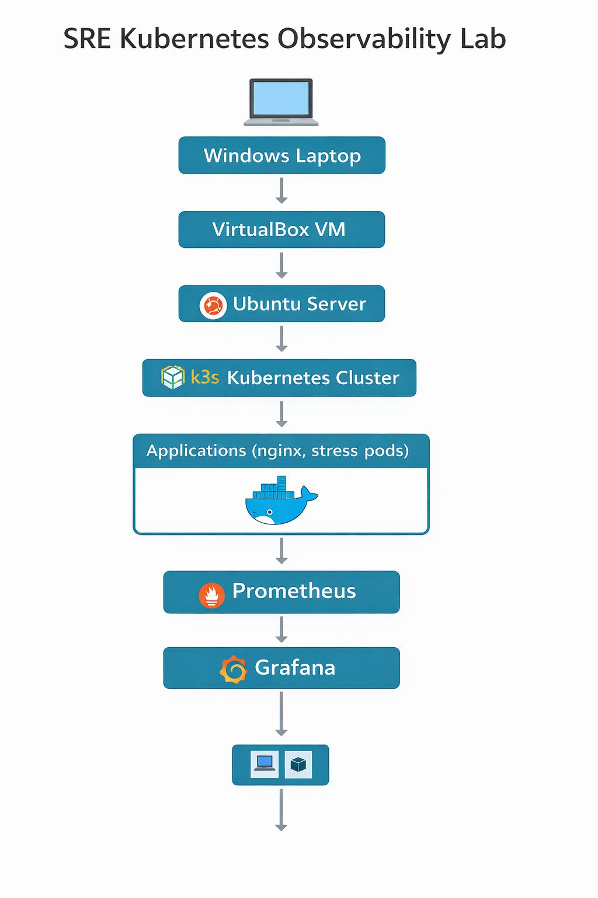

This environment simulates a production infrastructure stack.

Windows Laptop
↓
VirtualBox VM
↓
Ubuntu Server
↓
K3s Kubernetes Cluster
↓
Applications (nginx, demo workloads)
↓
Prometheus Monitoring
↓
Grafana Dashboards

---

# Infrastructure

Host Machine  
Windows Laptop

Virtualization  
VirtualBox

Operating System  
Ubuntu Server 24.04 LTS

Kubernetes Distribution  
K3s Kubernetes

This environment runs a full Kubernetes stack inside a virtual machine.

---

# Step 1 – VM Network Configuration

Networking inside the Ubuntu VM was verified.

Command used:

hostname -I

This shows interfaces used by:

- VirtualBox networking
- Docker bridge network
- Kubernetes pod networking

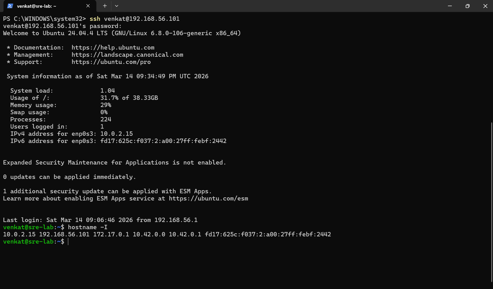

---

# Step 2 – Kubernetes Cluster Verification

A lightweight Kubernetes cluster was deployed using **k3s**.

Cluster health verification:

kubectl get nodes

The node status shows **Ready**, confirming the Kubernetes control plane is running.

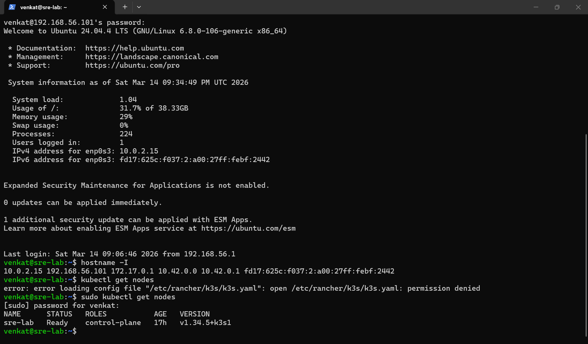

---

# Step 3 – Running Kubernetes Pods

All running workloads were verified across namespaces.

kubectl get pods -A

Running components include:

Monitoring Stack

- Prometheus
- Grafana
- Node Exporter
- kube-state-metrics

Applications

- nginx deployment
- demo workloads

System Components

- CoreDNS
- metrics-server
- Traefik ingress controller

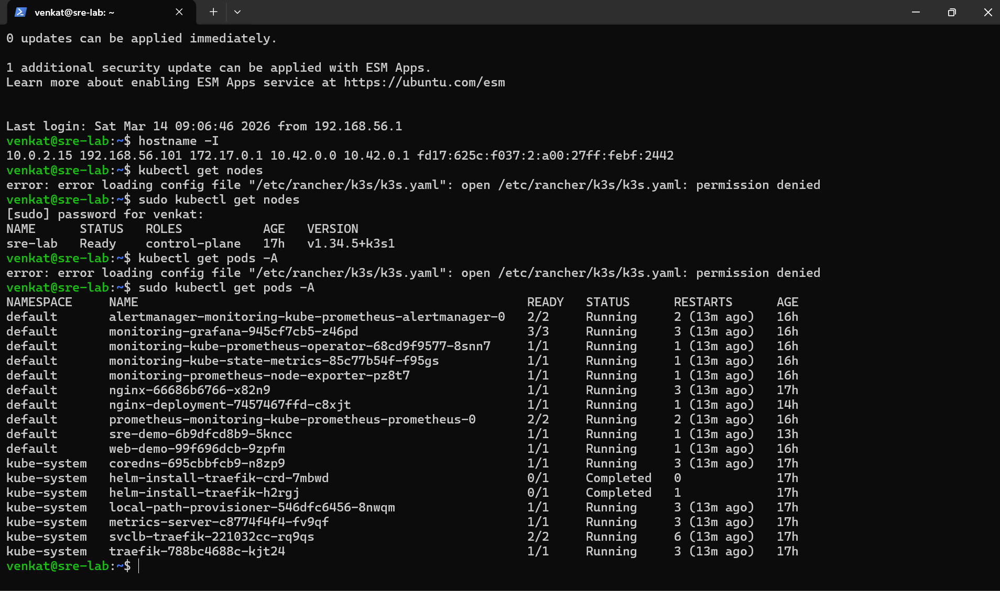

---

# Step 4 – Kubernetes Services

Services expose applications and monitoring components.

kubectl get svc

Services include:

- Grafana service
- Prometheus service
- nginx NodePort service
- demo application services

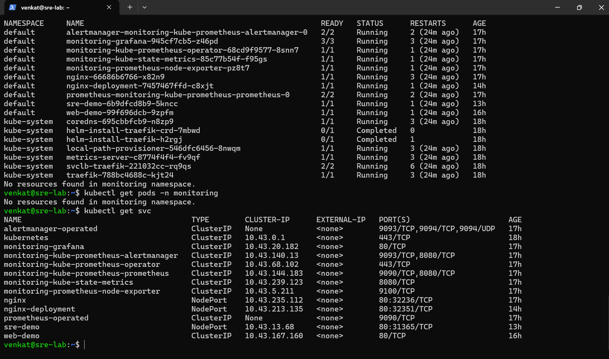

---

# Step 5 – Docker Images

Applications were containerized using Docker before deployment.

docker images

Custom application image:

venkatbalajiumashankar/sre-ci-cd-demo

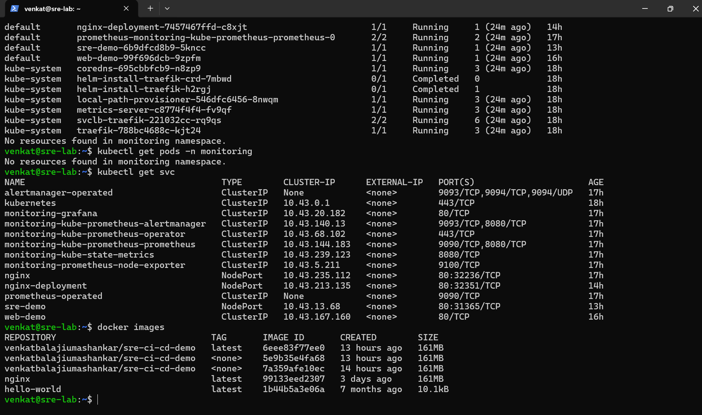

---

# Step 6 – Accessing Grafana

Grafana dashboards were accessed using Kubernetes port forwarding.

kubectl port-forward svc/monitoring-grafana 3000:80

Access Grafana:

[http://localhost:3000](http://127.0.0.1:3000)

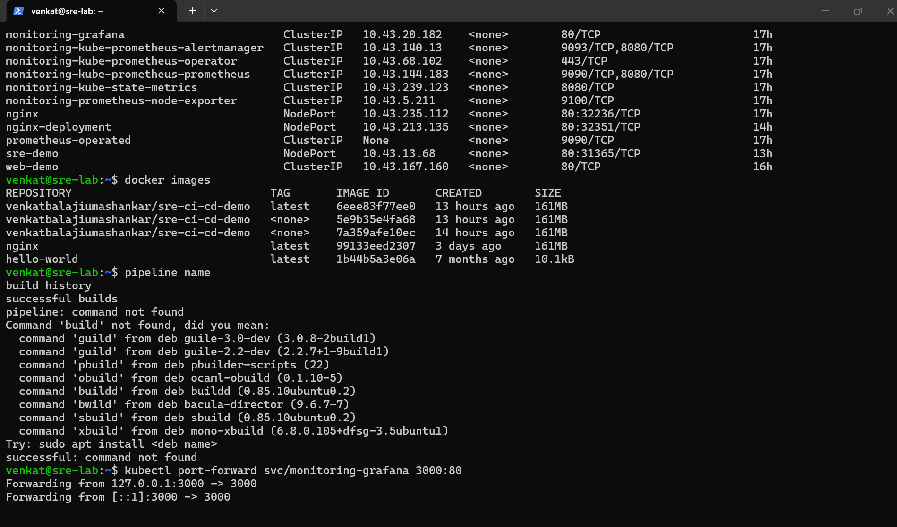

---

# Step 7 – Grafana Monitoring Dashboards

Grafana visualizes Prometheus metrics for the Kubernetes cluster.

Metrics monitored include:

- CPU utilization
- Memory utilization
- Pod resource consumption
- Namespace workloads
- Cluster health metrics

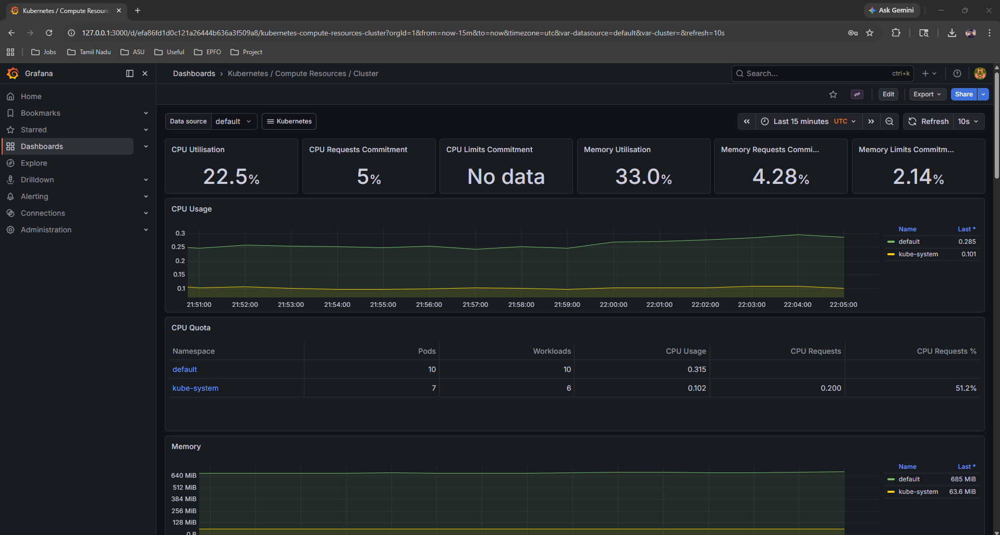

---

# Step 8 – Jenkins CI/CD Pipelines

Jenkins automates container build and deployment.

Configured pipelines:

Docker Build Pipeline  
Builds container images.

Kubernetes Deployment Pipeline  
Deploys applications into the cluster.

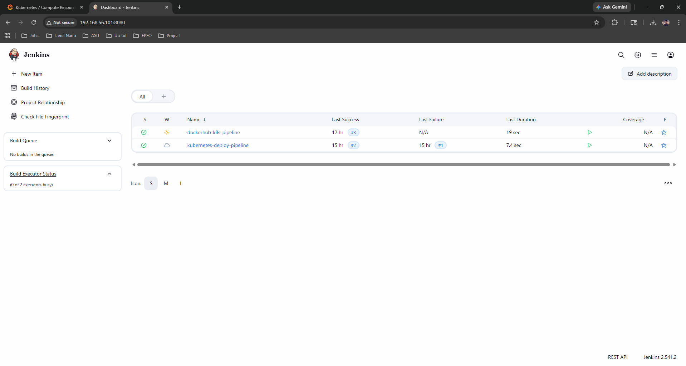

---

# Step 9 – Successful CI/CD Deployment

The Jenkins pipeline builds the Docker image and deploys it automatically.

Pipeline output confirms success.

Finished: SUCCESS

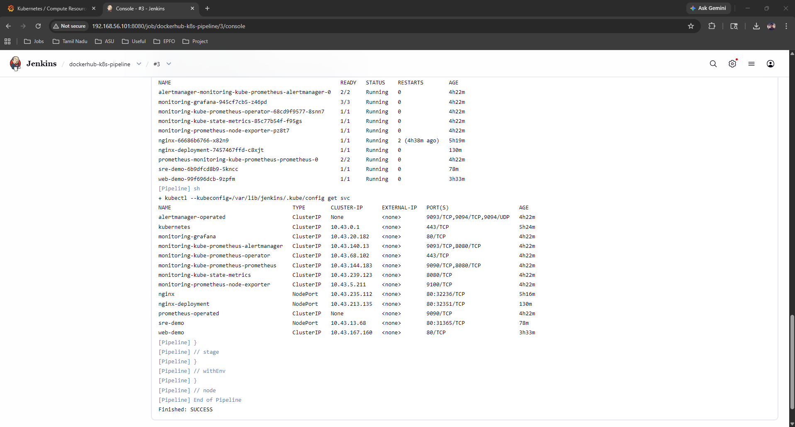

---

# Step 10 – Kubernetes Deployment Verification

Final verification of running deployments.

kubectl get deployments

Running deployments include:

- nginx
- web-demo
- sre-demo
- monitoring components

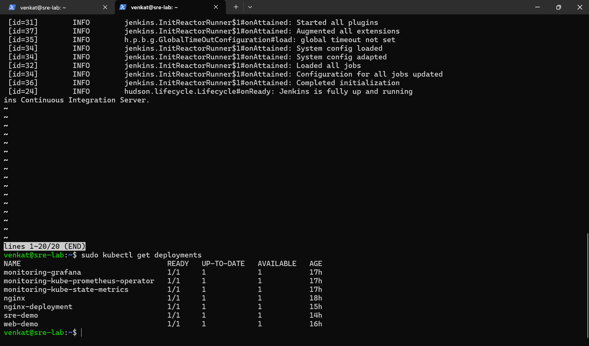

---

# Observability Stack

The monitoring system consists of:

Prometheus  
Collects metrics from Kubernetes nodes and pods.

Grafana  
Visualizes cluster metrics.

Alertmanager  
Manages alert notifications.

Node Exporter  
Provides node-level system metrics.

This stack enables full **cluster observability and monitoring**.

---

# Production Incident Simulation

This lab includes simulated production incidents.

CPU Spike Simulation

A stress workload was deployed to generate high CPU usage.

Incident investigation workflow:

1. Deploy stress workload
2. Observe CPU spike in Grafana
3. Identify affected pods
4. Analyze metrics
5. Adjust deployment resources

This demonstrates how SRE teams detect and investigate system issues.

---

# Skills Demonstrated

Kubernetes cluster deployment  
Containerized application management  
CI/CD automation with Jenkins  
Prometheus monitoring setup  
Grafana dashboard visualization  
Infrastructure observability  
Incident investigation workflows  
Kubernetes autoscaling

---

# Author

Venkat Balaji Umashankar  
MS Information Technology – Cybersecurity  
Arizona State University

Focus Areas

Site Reliability Engineering  
Cloud Infrastructure  
Kubernetes Operations  
Observability Systems

